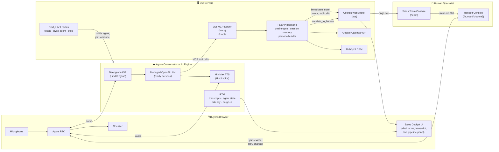
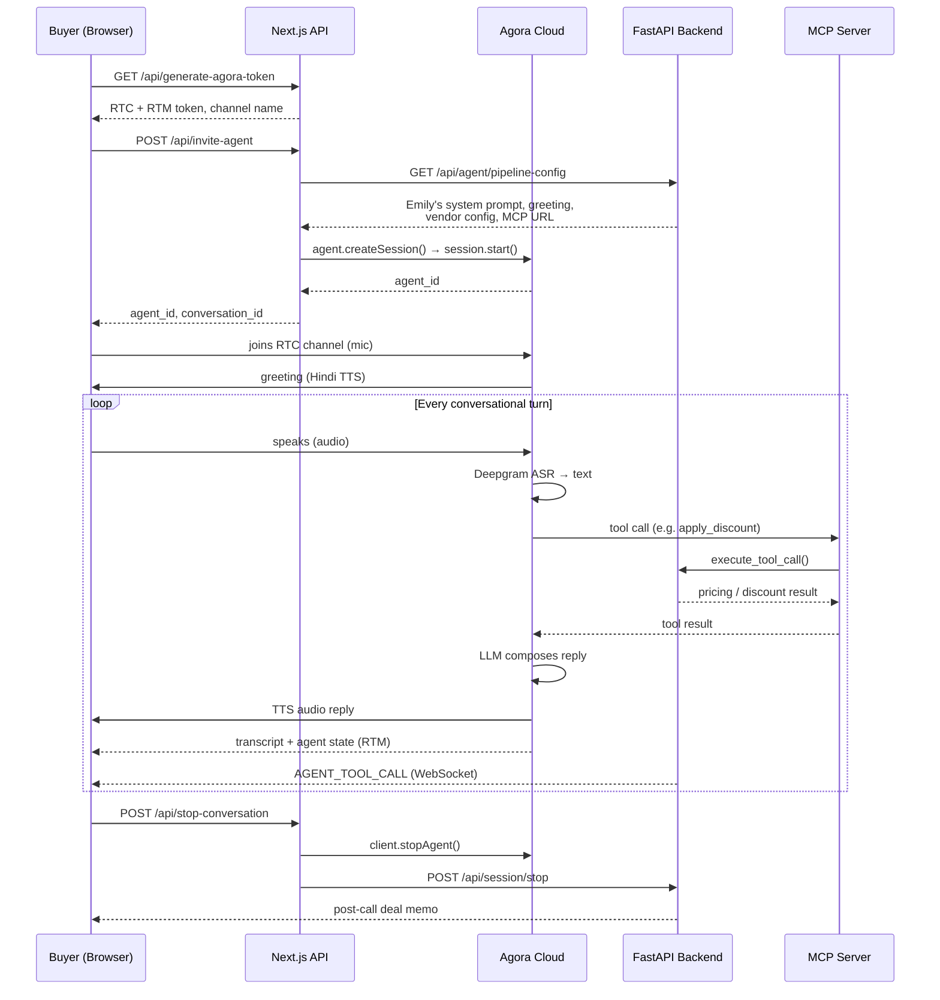
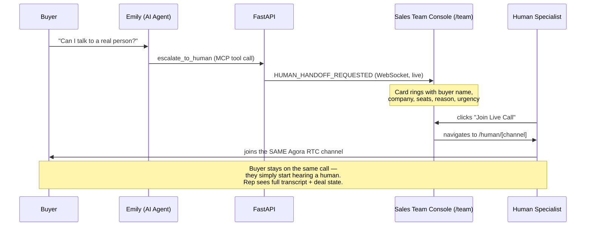
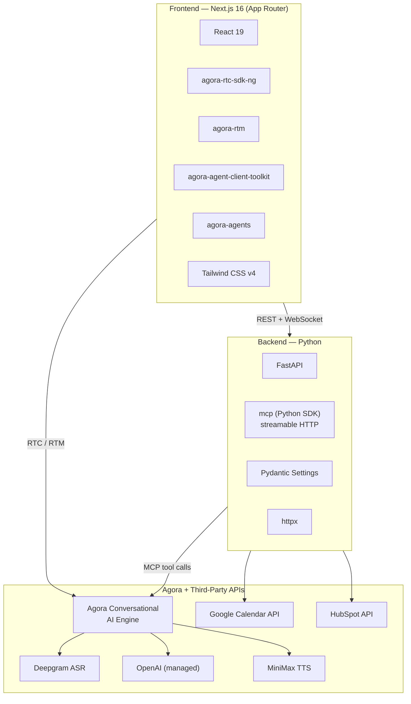

<p align="center">
  <strong>Real-time voice AI sales negotiation agent · Agora Conversational AI · Agora MCP · Live human RTC handoff</strong>
</p>

<p align="center">
  
  
  
  
  
</p>

<p align="center">
  <a href="https://ai-sales-venom.vercel.app/">Live Demo</a> ·
  <a href="#architecture">Architecture</a> ·
  <a href="#quick-start">Quick Start</a> ·
  <a href="#agora-mcp--the-deal-engine">Agora MCP</a> ·
  <a href="#tech-stack">Tech Stack</a>
</p>

---

**TeamSync AI Sales & Negotiation Agent** is a real-time voice AI sales rep — **Emily** — that runs a complete enterprise sales negotiation over a live, phone-quality call. It isn't a scripted IVR or a text chatbot wearing a microphone: it's built end-to-end on **Agora's Conversational AI Engine**, quotes real pricing, holds a margin floor, trades a discount for a concession, remembers everything the buyer said earlier in the call, books a genuine Google Calendar meeting, and hands off to a live human over **Agora RTC** when asked.

> **Status:** actively developed for the EchoSphere Agora Conversational AI Hackathon, track: *Adaptive AI Sales & Negotiation Agent*.

**🔗 Live demo:** **https://ai-sales-venom.vercel.app/**
**🔗 Repository:** https://github.com/harshsinghsv/ai-sales

## Table of contents

- [Why this project](#why-this-project)
- [What makes it real, not simulated](#what-makes-it-real-not-simulated)
- [Architecture](#architecture)
- [The voice pipeline](#the-voice-pipeline)
- [Agora MCP — the deal engine](#agora-mcp--the-deal-engine)
- [Human-in-the-loop escalation over Agora RTC](#human-in-the-loop-escalation-over-agora-rtc)
- [Live pipeline telemetry](#live-pipeline-telemetry)
- [Tech stack](#tech-stack)
- [Repository layout](#repository-layout)
- [Quick start](#quick-start)
- [Environment variables](#environment-variables)
- [Deployment](#deployment)
- [API reference](#api-reference)
- [Testing](#testing)
- [Known limitations](#known-limitations)
- [License](#license)

## Why this project

Cold outbound and inbound sales calls are repetitive, expensive, and inconsistent — reps repeat the same pitch, handle the same three objections, and lose context between calls. We wanted to prove that a voice-native AI agent, built on Agora's real-time infrastructure, can carry a conversation that genuinely **negotiates** rather than just answers FAQs:

- Understands what the buyer needs through natural spoken conversation
- Quotes real, tiered pricing and enforces a hard margin floor
- Trades every discount for a concession (annual commitment, case study, etc.)
- Remembers seats, use case, objections, and contact details across the whole call
- Books a **real** calendar meeting with a **real** Google Meet link and email invite
- Escalates to a **real human**, live, over the **same Agora RTC channel** — not a callback queue

## What makes it real, not simulated

| Claim | How it's actually implemented |
| --- | --- |
| Runs on Agora Conversational AI | `agora-agents` SDK builds a fresh agent per call — Deepgram ASR, Agora-managed OpenAI LLM, MiniMax TTS — no other RTC/voice vendor in the loop |
| Uses Agora MCP for real actions | Our own deal engine (pricing, discount, CRM, calendar, escalation) is exposed as an MCP server; Agora's engine calls it **directly**, mid-conversation |
| Books a real meeting | `book_meeting` creates a genuine Google Calendar event via OAuth (not a mocked API), with a real Meet link and an emailed invite |
| Live pipeline telemetry | Per-turn ASR / LLM / TTS latency and every MCP tool call stream over RTM into a visible cockpit panel |
| Human escalation is a live takeover | The specialist joins the buyer's **existing Agora RTC channel** — same call, same voice link — with the full transcript and deal state already loaded |
| Natural interruption handling | Agora's cloud VAD detects barge-ins; the agent's turn is cut and the buyer's new utterance is processed immediately |

## Architecture

Voice audio never touches our servers directly — it flows entirely through Agora's Conversational AI Engine. Our backend supplies the *brain* (persona, pricing, memory) and the *hands* (MCP tools); Agora supplies the *ears*, the *mouth*, and the *real-time transport*.



**Key architectural decision:** the Aarav/Emily persona, pricing logic, and negotiation memory live entirely in **Python** (`backend/`) — never duplicated in TypeScript. The Next.js API routes fetch the persona and pipeline config from FastAPI (`GET /api/agent/pipeline-config`) and hand it to Agora when starting the agent, so there is exactly one source of truth for how the agent thinks.

## The voice pipeline



## Agora MCP — the deal engine

This is the project's core answer to *"how does the agent actually **do** things, not just talk?"*

On Agora's managed-LLM path, the model running inside Agora's cloud has **no access to our Python code** — so without MCP, Emily could describe pricing but never compute or enforce it. We solved this by standing up our own **MCP server** (`backend/mcp_server.py`) and registering it directly on the agent via `llm.mcp_servers`, so Agora's engine calls our tools itself, mid-conversation, over `streamable_http`.

```mermaid
flowchart TD
    LLM["Agora-managed LLM"] -->|"llm.mcp_servers"| MCPServer["Our MCP Server<br/>/mcp/?cid=&lt;conversation_id&gt;"]
    MCPServer --> T1["get_pricing<br/>tiered seat pricing"]
    MCPServer --> T2["apply_discount<br/>margin floor + trade"]
    MCPServer --> T3["create_crm_lead<br/>HubSpot"]
    MCPServer --> T4["book_meeting<br/>real Google Calendar event"]
    MCPServer --> T5["update_session_state<br/>negotiation memory"]
    MCPServer --> T6["escalate_to_human<br/>live RTC handoff"]

    T1 & T2 & T3 & T4 & T5 & T6 --> Shared["execute_tool_call()<br/>(shared with the<br/>custom-LLM path)"]
    Shared --> Broadcast["Cockpit WebSocket<br/>AGENT_TOOL_CALL"]
```



Every tool delegates to the same `execute_tool_call()` function the custom-LLM middleware path uses — **one implementation of the negotiation logic**, exposed over two transports. Because that function already broadcasts state, an MCP tool call invoked by Agora's cloud lights up the Deal Cockpit UI in real time, tagged **"via Agora MCP"**.

| Tool | What it actually does |
| --- | --- |
| `get_pricing` | Computes tiered seat pricing (Starter / Pro / Enterprise) and monthly/annual totals |
| `apply_discount` | Checks a requested discount against a hard per-tier margin floor and pairs any approval with a mandatory trade |
| `create_crm_lead` | Creates/updates a Contact + Deal in HubSpot CRM |
| `book_meeting` | Parses the buyer's own words ("tomorrow at 3pm") into a real time slot and creates a genuine Google Calendar event with a Meet link and emailed invite |
| `update_session_state` | Records seats, use case, must-haves, contact details, and objections into session memory |
| `escalate_to_human` | Flags the session, notifies the Sales Team Console, and mints a live RTC hand-off link |

Session scoping travels in the MCP URL itself (`?cid=<conversation_id>`), so the model never has to remember or repeat a session id — Agora just calls the URL it was given.

## Human-in-the-loop escalation over Agora RTC

When the buyer asks for a person, or the negotiation deadlocks, escalation is a **real voice takeover**, not a support ticket:



The **Sales Team Console** (`/team`) hydrates any escalation still pending from `GET /api/escalations` on load, then listens live for new ones — so a specialist who opens the console *after* the escalation fired doesn't miss it.

## Live pipeline telemetry

The cockpit's **Agora Pipeline panel** shows, live, exactly what the engine is doing on every turn:

- Per-stage latency (ASR / LLM / TTS) sourced from Agora's own `AGENT_METRICS` events over RTM
- Every MCP tool call, tagged `via Agora MCP`, with its arguments and result
- A running count of barge-ins (`AGENT_INTERRUPTED`) the engine has handled

Nothing on this panel is simulated client-side — it is all decoded from Agora's real-time event stream.

## Tech stack



| Layer | Technology |
| --- | --- |
| Frontend framework | Next.js 16 (App Router), React 19, TypeScript (strict) |
| Styling | Tailwind CSS v4 |
| Real-time voice | `agora-agents`, `agora-rtc-sdk-ng`, `agora-rtm`, `agora-agent-client-toolkit` |
| ASR | Deepgram (nova-3, Hindi/English code-switching), Agora-managed credentials |
| LLM | OpenAI (Agora-managed), or Sarvam via our FastAPI custom-LLM middleware |
| TTS | MiniMax (speech-2.8-turbo, Hindi voice), Agora-managed credentials |
| Backend framework | FastAPI (Python) |
| Agentic tool layer | Official `mcp` Python SDK — streamable HTTP MCP server |
| Calendar | Google Calendar API v3, OAuth user refresh-token flow |
| CRM | HubSpot API |
| Escalation | Slack incoming webhook + live Agora RTC handoff |
| Testing | pytest (27 backend tests) |
| Deployment | Vercel (frontend) · Docker / Railway (backend) |

## Repository layout

```
ai-sales/
├── app/                          Next.js App Router
│   ├── api/
│   │   ├── generate-agora-token/ RTC + RTM token (agora-token)
│   │   ├── invite-agent/         builds & starts the Agora agent (agora-agents)
│   │   ├── stop-conversation/    stops the agent, finalizes the session
│   │   └── agent-think/          injects typed cockpit messages into the live call
│   ├── human/[channel]/          live RTC hand-off console for a specialist
│   ├── team/                     Sales Team Console — live escalation queue
│   ├── page.tsx, layout.tsx      landing page ⇄ sales cockpit shell
│   └── globals.css
├── components/                   SalesCockpit, DealCockpitPanel, LiveTranscript,
│                                  VoiceOrb, AgoraPipelinePanel, PostCallDealMemo,
│                                  IntegrationToasts, LandingPage, ui/
├── hooks/
│   ├── useAgoraVoice.ts          voice runtime: RTC join, RTM, toolkit events
│   └── useHumanHandoff.ts        specialist-side RTC join into the same channel
├── lib/                          agora.ts, conversation.ts, agent-registry.ts, types.ts
├── types/conversation.ts         lifecycle contracts shared with the API routes
└── backend/                      FastAPI application
    ├── server.py                 all REST + WebSocket routes
    ├── mcp_server.py             the Deal Engine MCP server (6 tools)
    ├── config.py                 environment-driven settings
    ├── deal_engine/engine.py     tiered pricing, quotes, concession policy
    ├── middleware/
    │   ├── custom_llm.py         session memory, tool execution, WS broadcasts
    │   └── sales_persona.py      Emily's stage-aware system prompt
    ├── services/
    │   ├── calendar_client.py    real Google Calendar booking (OAuth)
    │   ├── hubspot_client.py     HubSpot CRM sync
    │   ├── escalation_client.py  Slack webhook dispatch
    │   └── agora_convo_client.py legacy backend-side agent join (see Notes)
    ├── scripts/google_calendar_auth.py   one-time OAuth authorization script
    └── tests/                    27 passing tests
```

## Quick start

### Prerequisites

- Node.js 18+ and npm
- Python 3.12+
- An [Agora](https://console.agora.io) account (300 free Conversational AI minutes on sign-up)
- (Optional but recommended) A Google Cloud project for real calendar booking

### 1. Clone and configure

```bash
git clone https://github.com/harshsinghsv/ai-sales.git
cd ai-sales
cp .env.example .env
```

Fill in at minimum:

```bash
NEXT_PUBLIC_AGORA_APP_ID=<your Agora App ID>
NEXT_AGORA_APP_CERTIFICATE=<your Agora App Certificate>
```

Everything else — Deepgram ASR, the LLM, and MiniMax TTS — runs on **Agora-managed credentials** by default. No separate provider keys are required to get a full call working.

### 2. Install dependencies

```bash
npm install
```

```bash
python -m pip install -r backend/requirements.txt
```

### 3. Run the backend

```bash
python -m uvicorn backend.server:app --reload --port 8000
```

### 4. Run the frontend

```bash
npm run dev
```

Open **http://localhost:3000**, click **Talk to Sales**, and grant microphone access.

### 5. (Optional) Enable real Google Calendar booking

```bash
python -m backend.scripts.google_calendar_auth
```

Follow the printed URL, authorize with your Google account, and paste the returned refresh token into `.env` as `GOOGLE_OAUTH_REFRESH_TOKEN`. Full setup steps are documented inline in `.env.example`.

## Environment variables

The full annotated list lives in [`.env.example`](.env.example). The most important groups:

| Group | Purpose |
| --- | --- |
| `NEXT_PUBLIC_AGORA_APP_ID`, `NEXT_AGORA_APP_CERTIFICATE` | Agora RTC + RTM auth — required |
| `AGORA_STT_VENDOR`, `AGORA_TTS_VENDOR` | `deepgram` / `minimax` (Agora-managed, default) or `sarvam` (BYOK) |
| `AGORA_LLM_MODE` | `managed_openai` (default, Agora-hosted) or `custom` (routes to our FastAPI middleware) |
| `AGORA_MCP_ENABLE_DEAL_ENGINE` | Registers our own MCP server with the agent (default `true`) |
| `PUBLIC_BASE_URL` | Must be a **publicly reachable** URL — Agora's cloud calls back into this for MCP and the custom-LLM path |
| `GOOGLE_OAUTH_CLIENT_ID/SECRET/REFRESH_TOKEN` | Real Google Calendar booking — omit for a clearly-labelled simulated booking instead |
| `HUBSPOT_ACCESS_TOKEN` | Real HubSpot sync — omit for a sandboxed CRM response |
| `SLACK_WEBHOOK_URL` | Escalation alerts to Slack (independent of the live RTC handoff, which always works) |
| `HUMAN_HANDOFF_BASE_URL` | Public frontend origin — used to build the `/human/[channel]` link a specialist opens |

## Deployment

**Live demo:** the frontend is deployed on **Vercel** at **[ai-sales-venom.vercel.app](https://ai-sales-venom.vercel.app/)**.

- **Frontend (Vercel):** deploy the repository root directly — Vercel auto-detects Next.js. Set the `NEXT_PUBLIC_*` and Agora env vars in the Vercel project settings.
- **Backend:** Agora's cloud must be able to reach the backend (for MCP tool calls and the custom-LLM path), so it cannot stay on `localhost` for a live deployment. `backend/Dockerfile` + `railway.json` build and run it on Railway or any Docker-compatible host.

After deploying both halves, set:

```bash
PUBLIC_BASE_URL=<your deployed backend URL>
HUMAN_HANDOFF_BASE_URL=<your deployed frontend URL>
NEXT_PUBLIC_BACKEND_URL=<your deployed backend URL>
NEXT_PUBLIC_WS_URL=wss://<your deployed backend host>/ws
```

## API reference

| Method | Route | Purpose |
| --- | --- | --- |
| `GET` | `/api/generate-agora-token` | Next.js — issues an RTC + RTM token and channel name |
| `POST` | `/api/invite-agent` | Next.js — builds and starts the Agora agent for a session |
| `POST` | `/api/stop-conversation` | Next.js — stops the agent, finalizes the backend session |
| `POST` | `/api/agent-think` | Next.js — injects a typed cockpit message into the live agent |
| `GET` | `/health` | FastAPI — service + integration status |
| `GET` | `/api/agent/pipeline-config` | FastAPI — serves Emily's persona, greeting, and vendor config |
| `POST` | `/v1/chat/completions` | FastAPI — OpenAI-compatible endpoint for the custom-LLM path |
| `POST` | `/api/stt`, `/v1/audio/speech` | FastAPI — Sarvam STT/TTS shims (BYOK path) |
| `GET`/`POST` | `/api/session/{id}`, `/api/session/start`, `/api/session/stop` | FastAPI — session lifecycle |
| `GET` | `/api/session/{id}/deal-memo` | FastAPI — the post-call executive deal memo |
| `POST` | `/api/deal/quote`, `/api/deal/concession` | FastAPI — deal-engine playground endpoints |
| `GET` | `/api/escalations` | FastAPI — pending human-handoff queue |
| `POST` | `/api/escalations/{id}/resolve` | FastAPI — marks an escalation as picked up |
| `WS` | `/ws` | FastAPI — live Deal Cockpit, tool calls, and escalation broadcasts |
| `POST` | `/mcp/?cid={conversation_id}` | FastAPI — the Deal Engine MCP server, called directly by Agora |

## Testing

```bash
npm run typecheck
npm run build
python -m pytest backend/tests -q
```

27 backend tests cover the deal engine's pricing/concession logic, the MCP tool wiring, the escalation queue, natural-language meeting-time parsing, and the pipeline-config contract.

## Known limitations

- `backend/services/agora_convo_client.py` and `POST /api/session/start` are a legacy backend-side agent join, superseded by `/api/invite-agent`. Calling both for the same channel would start two agents — retained only for backend-only testing.
- Without `GOOGLE_OAUTH_REFRESH_TOKEN` / `HUBSPOT_ACCESS_TOKEN`, calendar booking and CRM sync run in a clearly-labelled **simulated** mode so the demo still runs end-to-end.
- A Google OAuth app left in "Testing" status issues refresh tokens that expire after 7 days — publish the app in Google Cloud Console for a permanent token.

## License

No license file is currently included in this repository — add one (e.g. MIT) before any external reuse or distribution.

---

<p align="center">
  Built for the <strong>EchoSphere Agora Conversational AI Hackathon</strong>
  ·
  <a href="https://ai-sales-venom.vercel.app/">Live Demo</a>
</p>
